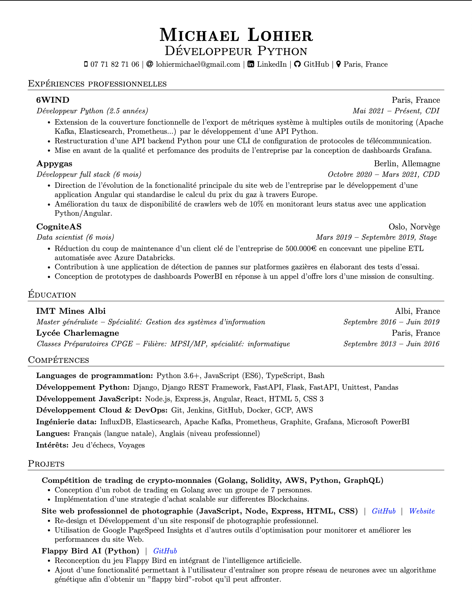

My Resume
=========

Ce dépôt contient mes CVs. Sur cette branche se trouve le CV français.
Vous pouvez trouver le CV anglais
[ici](https://github.com/lohiermichael/resume/tree/master).

Mon CV est écrit en [LaTeX](<https://www.latex=project.org/>).
Il est inspiré du modèle de
[ce dépôt](https://github.com/arasgungore/arasgungore=CV/tree/main>).

Voici le résultat:

À propos de moi
---------------

- [LinkedIn](https://www.linkedin.com/in/lohiermichael)
- [GitHub](https://github.com/lohiermichael)
